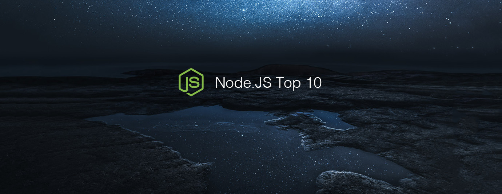

# Node.js Top 10 Articles for the Past Month (v.Jun 2018)

</a>

For the past month, we ranked nearly 900 Node.js articles to pick the Top 10 stories that can help advance your career (0.9% chance).

* Topics in this list: REST APIs, JSConf, Twitter Bot, Automating, Node.js 10, Passport.js, Web Scraping, AWS Lambda, Docker, Facebook messenger
* Also published on [Medium](https://goo.gl/u8kurK)

 

### Course of the month:

[A) Beginners: The Complete Node.js Developer Course (2nd Edition)](http://bit.ly/2FScDHt) [17,049 recommends, 4.6/5 stars]

[B) Advanced: Node.js: The Complete Guide to Build RESTful APIs (2018)](http://bit.ly/2JEYUZw) [677recommends, 4.7/5 stars]

 

## Rank 1
### [How to set-up a powerful API with Nodejs, GraphQL, MongoDB, Hapi, and Swagger](https://medium.freecodecamp.org/how-to-setup-a-powerful-api-with-nodejs-graphql-mongodb-hapi-and-swagger-e251ac189649?utm_source=mybridge&utm_medium=blog&utm_campaign=read_more)

 

## Rank 2
### [10 Things I Regret About Node.js - Ryan Dahl - JSConf EU 2018](https://www.youtube.com/watch?v=M3BM9TB-8yA?utm_source=mybridge&utm_medium=blog&utm_campaign=read_more)

 

## Rank 3
### [The 7 Biggest Lessons I’ve Learned By Building A Twitter Bot ](https://hackernoon.com/the-7-biggest-lessons-ive-learned-by-building-a-twitter-bot-59fee84a9ed9?utm_source=mybridge&utm_medium=blog&utm_campaign=read_more)

 

## Rank 4
### [How I automated my job with Node.js](https://medium.com/dailyjs/how-i-automated-my-job-with-node-js-94bf4e423017?utm_source=mybridge&utm_medium=blog&utm_campaign=read_more)

 

## Rank 5
### [What's New In Node.js 10?](https://www.youtube.com/watch?v=qWoXz-f6HUg?utm_source=mybridge&utm_medium=blog&utm_campaign=read_more)

 

## Rank 6
### [Passport-api-docs: Documentation for Passport.js.](https://github.com/jwalton/passport-api-docs?utm_source=mybridge&utm_medium=blog&utm_campaign=read_more)

 

## Rank 7
### [Web Scraping Scotch: The Node Way](https://scotch.io/tutorials/web-scraping-scotch-the-node-way?utm_source=mybridge&utm_medium=blog&utm_campaign=read_more)

 

## Rank 8
### [Getting Started with AWS Lambda and Node.js](https://dev.to/adnanrahic/getting-started-with-aws-lambda-and-nodejs-1kcf?utm_source=mybridge&utm_medium=blog&utm_campaign=read_more)

 

## Rank 9
### [Node.js Docker workflow](https://medium.com/@guillaumejacquart/node-js-docker-workflow-12febcc0eed8?utm_source=mybridge&utm_medium=blog&utm_campaign=read_more)

 

## Rank 10
### [Building a Facebook Messenger Chat Bot with Node.js](https://quantizd.com/building-facebook-messenger-bot-with-nodejs?utm_source=mybridge&utm_medium=blog&utm_campaign=read_more)

