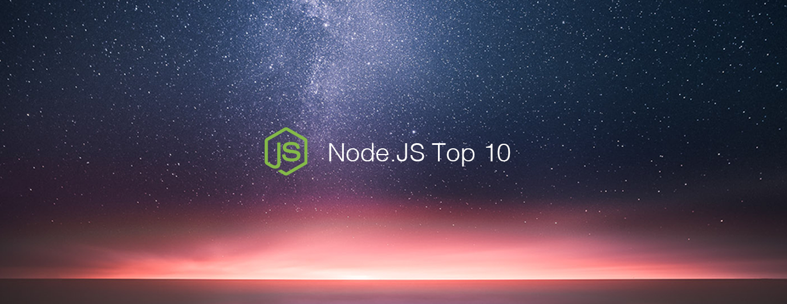

# Node.js Top 10 Articles for the Past Month (v.June 2019)

</a>

For the past month, we ranked nearly 1,000 Node.js articles to pick the Top 10 stories that can help advance your career (1% chance).

* Also published on [Medium](https://medium.mybridge.co/node-js-top-10-articles-for-the-past-month-v-june-2019-965acf75a02d)

 

### Course of the month:

[A) Beginner: Master Node JS, build REST APIs with Node.js, GraphQL APIs, add Authentication, use MongoDB, SQL](http://bit.ly/2Pgjlzx) [36,441 recommends, 4.7/5 stars]

[B) Advanced: Node JS: Advanced Concepts.](http://bit.ly/2z5cvFc) [19,157 recommends, 4.7/5 stars]

 

 
## Rank 1
### [Building Live Streaming App with Node.js and React](https://quantizd.com/building-live-streaming-app-with-node-js-and-react?utm_source=mybridge&utm_medium=blog&utm_campaign=read_more)

 

## Rank 2
### [2.1 Server-side with Node.js - Working with Data and APIs in JavaScript](https://www.youtube.com/watch?v=wxbQP1LMZsw?utm_source=mybridge&utm_medium=blog&utm_campaign=read_more)

 

## Rank 3
### [You don't need passport.js - Guide to node.js authentication ✌️](https://softwareontheroad.com/nodejs-jwt-authentication-oauth?utm_source=mybridge&utm_medium=blog&utm_campaign=read_more)

 

## Rank 4
### [A Guide to Node.js Logging](https://www.twilio.com/blog/guide-node-js-logging?utm_source=mybridge&utm_medium=blog&utm_campaign=read_more)

 

## Rank 5
### [How to build a Node.js eCommerce website for free](https://adrianmejia.com/how-to-build-a-node-js-ecommerce-website-for-free?utm_source=mybridge&utm_medium=blog&utm_campaign=read_more)

 

## Rank 6
### [Impress your colleagues with these NPM tricks](https://dev.to/borrellidev/impress-your-colleagues-with-these-npm-tricks-3fcb?utm_source=mybridge&utm_medium=blog&utm_campaign=read_more)

 

## Rank 7
### [How to build a blazing fast GraphQL API with Node.js, MongoDB and Fastify](https://medium.com/free-code-camp/how-to-build-a-blazing-fast-graphql-api-with-node-js-mongodb-and-fastify-77fd5acd2998?utm_source=mybridge&utm_medium=blog&utm_campaign=read_more)

 

## Rank 8
### [Build A Node.js API Authentication With JWT Tutorial](https://www.youtube.com/watch?v=2jqok-WgelI?utm_source=mybridge&utm_medium=blog&utm_campaign=read_more)

 

## Rank 9
### [Node.js memory management in container environments](https://developer.ibm.com/articles/nodejs-memory-management-in-container-environments/
?utm_source=mybridge&utm_medium=blog&utm_campaign=read_more)

 

## Rank 10
### [How to Use Computer Vision to Automatically Filter Images with Node.js](https://dev.to/heroku/how-to-use-computer-vision-to-automatically-filter-images-3g7k?utm_source=mybridge&utm_medium=blog&utm_campaign=read_more)

                    
